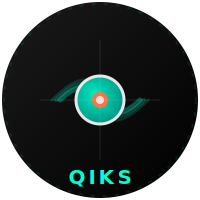

<p align="center">
  
</p>

# QIKS

**High-Performance TypeScript Caching Library**  
_Smart Caching for Modern Applications_

---

## 🔍 Introduction

QIKS is a next-generation caching solution designed for TypeScript/JavaScript applications requiring **blazing-fast in-memory operations**, **enterprise-grade features**, and **unparalleled flexibility**. Born from real-world needs in high-traffic systems, QIKS combines robust caching fundamentals with innovative capabilities.

### 🚀 Why Choose QIKS?

| Feature                       | Benefit                                         |
| ----------------------------- | ----------------------------------------------- |
| **µs-level Operations**       | Handle 1M+ ops/sec with sub-millisecond latency |
| **Military-Grade Eviction**   | LRU, LFU, MRU                                   |
| **Real-Time Insights**        | Built-in monitoring with 20+ metrics            |
| **Event-Driven Architecture** | 12+ event types with microsecond response       |
| **TypeSafe™ Guarantee**       | Full TypeScript generics support                |
| **Storage Agnostic**          | Map, WeakMap, or bring your own adapter         |

---

## 🌟 Features

### Core Capabilities

- **Lightning-Fast CRUD**  
  Atomic operations with O(1) complexity
- **Hybrid Expiration**  
  TTL + idle timeout + manual expiration
- **Dependency Graph**  
  Automatic cascade invalidation
  ```ts
  cache.set('order:123', data, {
    dependsOn: 'user:45',
  });
  ```
- **Namespace Isolation**  
  Logical separation without multiple instances
  ```ts
  const userCache = cache.namespace('users');
  ```

### Advanced Features

- **CacheTools Suite**

  - **BatchOps**: Bulk insert/update/delete
  - **Functional**: Map/filter/reduce pipelines
  - **FileOps**: Disk persistence & hydration

  ```ts
  // Batch insert 1K items
  cache.cacheTools.batchOps.setBatch(massiveDataset);

  // Save to disk
  await cache.cacheTools.fileOps.export('backup.json');
  ```

- **Event System**

  ```ts
  cache.on(EventType.Expire, ({ key }) => {
    console.log(`Expired: ${key}`);
  });
  ```

- **Adaptive Memory Management**  
  Automatic scaling with heap pressure detection

---

## 📦 Installation

```bash
npm install @medishn/qiks
# or
yarn add @medishn/qiks
```

## 🛠 Usage

### Basic Setup

```ts
import { Qiks } from '@medishn/qiks';

interface UserProfile {
  id: string;
  name: string;
}

// Create a cache instance with custom configuration
const cache = new Qiks<string, UserProfile>({
  maxSize: 10000, // Maximum number of items
  evictionPolicy: 'LRU', // Eviction strategy
  storage: 'map', // Use native Map for storage
});

// Set a cache entry with a TTL (in milliseconds)
cache.set('user:123', { id: '123', name: 'Alice' }, { ttl: 60000 });

// Retrieve the cache entry
const user = cache.get('user:123');
console.log(user); // Outputs: { id: '123', name: 'Alice' }

// Use namespaces to isolate cache entries
const userCache = cache.namespace('users');
userCache.set('456', { id: '456', name: 'Bob' });
console.log(userCache.get('456')); // Outputs: { id: '456', name: 'Bob' }
```

---

## 📚 Documentation

| Resource          | Description                      | Link                                                                 |
| ----------------- | -------------------------------- | -------------------------------------------------------------------- |
| **Core Concepts** | Architecture & Design Philosophy | [Wiki](https://github.com/medishen/qiks/wiki/Core-Concepts)          |
| **API Reference** | Complete Method Documentation    | [API Docs](https://github.com/medishen/qiks/wiki/QIKS-API-Reference) |

---

## 🤝 Contributing

We welcome contributions! Please follow our  
[Contribution Guidelines](https://github.com/medishen/qiks/blob/main/CONTRIBUTING.md).

**Quick Start for Devs:**

```bash
git clone https://github.com/medishen/qiks.git
cd qiks
npm install
npm run test
```

---

## 📜 License

MIT License - See [LICENSE](https://github.com/medishen/qiks/blob/main/LICENSE)

---

## 📬 Contact

| Channel         | Details                                                   |
| --------------- | --------------------------------------------------------- |
| **Issues**      | [GitHub Issues](https://github.com/medishen/qiks/issues)  |
| **Discussions** | [Q&A Forum](https://github.com/medishen/qiks/discussions) |
| **Email**       | [bitsgenix@gmail.com](mailto:bitsgenix@gmail.com)         |

---

**QIKS** - Because Your Data Deserves Speed®  
_An open-source project by [MediSHN Technologies](https://github.com/medishen)_
